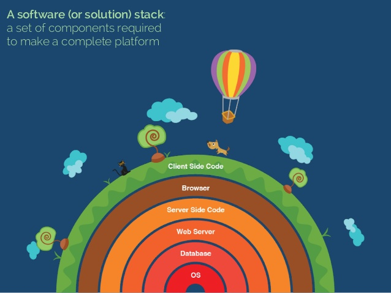
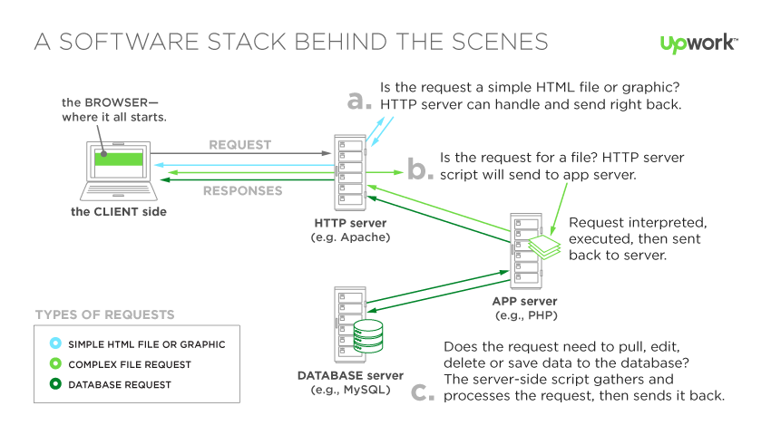

# TECHNICAL STACK
---
## Stack là gì, tại sao nó ra đời?
Để tạo ra 1 ứng dụng hoàn chỉnh, chỉ viết code không thôi là không đủ. Khi cần lưu trữ thông tin, ta phải đưa chúng vào cơ sở dữ liệu. Sau khi đã hoàn thành phần code, ta phải tìm cách deploy nó, tức là đưa code lên một chỗ nào đó để chạy code.

Một chương trình hoàn thiện không chỉ có code, mà còn phải có nền tảng hệ điều hành và những phần mềm đi kèm (web server, cơ sở dữ liệu). Người ta gom những thứ này lại với nhau (giống như ráp Lego ấy), tạo thành technical stack.

Technical Stack, còn gọi là solution stack, là một tập hợp những phần mềm/công nghệ phối hợp chung với nhau, tạo thành một nền tảng để ứng dụng có thể hoạt động được.

## Cấu tạo của Stack

Một stack thường được cấu tạo bởi các thành phần:
- Hệ điều hành
- Web Server
- Database Server
- Back-end Programming Language

VD: LAMP Stack, các thành phần:
- Linux
- Apache
- MySQL hoặc  MariaDB
- PHP hoặc Python

Mỗi thành phần trong stack đảm nhận một nhiệm vụ riêng biệt.

với LAMP stack, máy chủ sẽ chạy hệ điều hành Linux, cài server Apache Tomcat. Khi có request từ người dùng, server sẽ gọi code PHP, code này đọc dữ liệu từ cơ sở dữ liệu MySQL, render ra HTML về phía người dùng.

## Nguồn

https://toidicodedao.com/2017/05/23/giai-thich-technical-stack-la-gi/

https://en.wikipedia.org/wiki/Solution_stack
